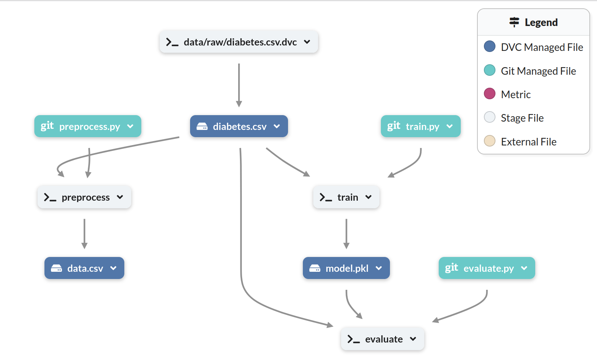

# Diabetes MLOps Pipeline

Projeto de Machine Learning com práticas de **MLOps** para construção de um pipeline reprodutível de treinamento, versionamento e gerenciamento de experimentos para predição de diabetes.

---

# Stacks utilizadas


---

# Descrição

Este projeto demonstra a construção de um **pipeline de Machine Learning com práticas de MLOps**, voltado para prever a probabilidade de diabetes em pacientes com base em variáveis clínicas.

O objetivo principal é apresentar uma arquitetura reprodutível para desenvolvimento de modelos de Machine Learning, incluindo:

* versionamento de dados
* rastreamento de experimentos
* automação de pipelines
* gerenciamento de modelos
* reprodutibilidade do treinamento

O projeto utiliza ferramentas amplamente adotadas no ecossistema de **MLOps**, permitindo reproduzir todo o fluxo de desenvolvimento do modelo, desde o processamento dos dados até o treinamento e registro dos experimentos.

---

# Demonstração

## Data Pipeline

Espaço reservado para inserir a imagem do pipeline disponível no DagsHub.

```

```

---

# Tecnologias utilizadas

O projeto utiliza as seguintes tecnologias:

**Linguagem**

* Python

**Machine Learning**

* Scikit-learn

**MLOps**

* DVC — versionamento de dados e pipelines
* MLflow — rastreamento de experimentos e métricas
* DagsHub — gerenciamento remoto de experimentos


---

# Instalação e configuração

## 1. Clonar o repositório

```bash
git clone https://github.com/ramoneirao/diabetes-mlops.git

cd diabetes-mlops
```

---

## 2. Criar ambiente virtual

Linux / Mac

```bash
python3 -m venv .venv
source .venv/bin/activate
```

Windows

```bash
python -m venv .venv
.venv\Scripts\activate
```

---

## 3. Instalar dependências

```bash
pip install -r requirements.txt
```

---

## 4. Baixar dados versionados

Caso o projeto utilize DVC com armazenamento remoto:

```bash
dvc pull
```

---

# Como usar

## Executar o pipeline de treinamento

O pipeline pode ser executado utilizando DVC:

```bash
dvc repro
```

Esse comando executa automaticamente todas as etapas definidas no pipeline.

Exemplo de etapas comuns:

* preparação dos dados
* engenharia de features
* treinamento do modelo
* avaliação do modelo

---

# Estrutura do projeto

```
diabetes-mlops
│
├── data
│   ├── raw
│   ├── processed
│
├── models
│
│
├── src
│   ├── init
│   ├── evaluate
│   ├── preprocess
│   └── train
│
├── dvc.yaml
├── params.yaml
├── requirements.txt
└── README.md
```

---

# Contribuição

Contribuições são bem-vindas.

Para contribuir:

1. Faça um fork do repositório
2. Crie uma branch

```bash
git checkout -b feature/minha-feature
```

3. Faça commit das alterações

```bash
git commit -m "feat: nova funcionalidade"
```

4. Envie para o repositório

```bash
git push origin feature/minha-feature
```

5. Abra um Pull Request.


---
👨‍💻 Author

Ramon Neirão Mendes

GitHub 
https://github.com/ramoneirao

DagsHub
https://dagshub.com/ramoneirao
